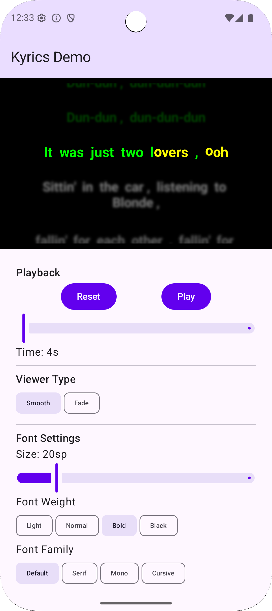

# Kyrics

[](https://jitpack.io/#lchau1017/Kyrics)
[](https://android-arsenal.com/api?level=31)
[](https://opensource.org/licenses/Apache-2.0)

A Jetpack Compose library for displaying synchronized karaoke-style lyrics with customizable visual styles.

<p align="center">
  
</p>

<p align="center">
  <a href="media/demo_video.webm">Watch Demo Video</a>
</p>

---

## Features

- **TTML Lyrics Parser** - Parse TTML lyrics with syllable-level timing and automatic format detection
- **Synchronized Lyrics Display** - Character-by-character and syllable-by-syllable highlighting
- **2 Viewer Types** - Smooth Scroll and Fade Through
- **Customizable Gradients** - Progress-based, multi-color gradient options
- **Blur Effects** - Optional blur on non-playing lines for focus effect
- **Type-Safe DSL** - Kotlin DSL for configuration and lyrics creation
- **Extension Functions** - Rich utilities for working with synced lines
- **Single Import** - All APIs available from `com.kyrics` package
- **Compose-First** - Built entirely with Jetpack Compose

---

## Table of Contents

- [Installation](#installation)
- [Quick Start](#quick-start)
- [Parsing Lyrics](#parsing-lyrics)
- [Creating Lyrics](#creating-lyrics)
- [Configuration](#configuration)
- [Viewer Types](#viewer-types)
- [Extension Functions](#extension-functions)
- [Data Models](#data-models)
- [State Management](#state-management)
- [Demo App](#demo-app)
- [Requirements](#requirements)
- [License](#license)

---

## Installation

### JitPack (Recommended)

**Step 1.** Add JitPack repository to your root `settings.gradle.kts`:

```kotlin
dependencyResolutionManagement {
    repositories {
        google()
        mavenCentral()
        maven { url = uri("https://jitpack.io") }
    }
}
```

**Step 2.** Add the dependency to your module's `build.gradle.kts`:

```kotlin
dependencies {
    implementation("com.github.lchau1017:Kyrics:v1.3.0")
}
```

### Alternative Installation Options

<details>
<summary>Local Project Dependency</summary>

Clone and include as a composite build:

```bash
git clone https://github.com/lchau1017/Kyrics.git
```

Add to `settings.gradle.kts`:

```kotlin
includeBuild("../Kyrics") {
    dependencySubstitution {
        substitute(module("com.kyrics:kyrics")).using(project(":kyrics"))
    }
}
```

Then add:

```kotlin
dependencies {
    implementation("com.kyrics:kyrics")
}
```

</details>

<details>
<summary>Copy Module</summary>

Copy the `kyrics` module into your project, add to `settings.gradle.kts`:

```kotlin
include(":kyrics")
```

Then add:

```kotlin
dependencies {
    implementation(project(":kyrics"))
}
```

</details>

---

## Quick Start

All Kyrics APIs are available from a single import:

```kotlin
import com.kyrics.*
```

### Basic Usage

```kotlin
@Composable
fun LyricsScreen(lyrics: List<KyricsLine>, currentTimeMs: Int) {
    KyricsViewer(
        lines = lyrics,
        currentTimeMs = currentTimeMs
    )
}
```

### With Configuration DSL

```kotlin
@Composable
fun LyricsScreen(lyrics: List<KyricsLine>, currentTimeMs: Int) {
    KyricsViewer(
        lines = lyrics,
        currentTimeMs = currentTimeMs
    ) {
        colors {
            playing = Color.Yellow
            sung = Color.Green
            unsung = Color.White
        }
        viewer {
            type = ViewerType.SMOOTH_SCROLL
        }
    }
}
```

---

## Parsing Lyrics

Kyrics includes a TTML lyrics parser with syllable-level timing support.

### Usage

```kotlin
import com.kyrics.*

val content = loadLyricsFile() // Your TTML file content as String

when (val result = parseLyrics(content)) {
    is ParseResult.Success -> {
        val lines = result.lines        // List<KyricsLine>
        val duration = result.durationMs // Total duration (nullable)

        KyricsViewer(
            lines = lines,
            currentTimeMs = currentTime
        )
    }
    is ParseResult.Failure -> {
        Log.e("Lyrics", "Parse error: ${result.error}")
    }
}
```

### ParseResult

```kotlin
sealed class ParseResult {
    data class Success(
        val lines: List<KyricsLine>,
        val durationMs: Long? = null
    ) : ParseResult()

    data class Failure(
        val error: String,
        val lineNumber: Int? = null
    ) : ParseResult()
}
```

---

## Creating Lyrics

### Using DSL Builder

```kotlin
import com.kyrics.*

val lyrics = kyricsLyrics {
    line(start = 0, end = 2000) {
        syllable("When ", start = 0, end = 200)
        syllable("the ", start = 200, end = 400)
        syllable("sun ", start = 400, end = 800)
        syllable("goes ", start = 800, end = 1200)
        syllable("down", start = 1200, end = 2000)
    }
    line(start = 2000, end = 4000) {
        syllable("And ", start = 2000, end = 2200)
        syllable("the ", start = 2200, end = 2400)
        syllable("stars ", start = 2400, end = 2800)
        syllable("come ", start = 2800, end = 3200)
        syllable("out", start = 3200, end = 4000)
    }
    // Background vocals
    accompaniment(start = 4000, end = 5000) {
        syllable("(ooh)", duration = 1000)
    }
}
```

### Duration-Based Syllables

```kotlin
val lyrics = kyricsLyrics {
    line(start = 0, end = 2000) {
        syllable("Hel", duration = 200)
        syllable("lo ", duration = 300)
        syllable("World", duration = 500)
    }
}
```

### Factory Functions

```kotlin
import com.kyrics.*

// Simple line (single syllable)
val line1 = kyricsLineFromText("Hello World", start = 0, end = 1000)

// Auto-split on whitespace
val line2 = kyricsLineFromWords("Hello World", start = 0, end = 1000)

// Accompaniment line
val line3 = kyricsAccompaniment("(Background)", start = 0, end = 1000)
```

---

## Configuration

### Full Configuration Example

```kotlin
import com.kyrics.*

val config = kyricsConfig {
    // Colors
    colors {
        playing = Color.Yellow
        played = Color.Green
        upcoming = Color.White
        background = Color.Black
    }

    // Typography
    typography {
        fontSize = 28.sp
        fontWeight = FontWeight.Bold
        textAlign = TextAlign.Center
    }

    // Gradient
    gradient {
        enabled = true
        angle = 45f
    }

    // Blur (non-playing lines)
    blur {
        enabled = true
        playedLineBlur = 2.dp
        upcomingLineBlur = 3.dp
        distantLineBlur = 5.dp
    }

    // Viewer type
    viewer {
        type = ViewerType.SMOOTH_SCROLL
    }

    // Layout
    layout {
        lineSpacing = 16.dp
    }
}
```

### Presets

```kotlin
// Use a preset configuration
KyricsViewer(
    lines = lyrics,
    currentTimeMs = currentTime,
    config = KyricsPresets.Classic
)

// Available presets
KyricsPresets.Classic  // Yellow/Green on black, bold
KyricsPresets.Neon     // Cyan/Magenta with gradient
```

---

## Viewer Types

| Viewer | Description |
|--------|-------------|
| `SMOOTH_SCROLL` | Standard vertical scrolling with smooth animations |
| `FADE_THROUGH` | Pure opacity transitions between lines |

---

## Extension Functions

All extension functions are available from `com.kyrics.*`:

### Finding Lines

```kotlin
val currentLine = lyrics.findLineAtTime(timeMs)
val currentIndex = lyrics.findLineIndexAtTime(timeMs)
val nextLine = lyrics.findNextLine(timeMs)
val prevLine = lyrics.findPreviousLine(timeMs)
```

### Progress Calculations

```kotlin
val progress = line.progressAt(timeMs)  // 0.0 to 1.0
val overallProgress = lyrics.calculateOverallProgress(timeMs)
```

### Time Utilities

```kotlin
val duration = line.duration
val totalDuration = lyrics.getTotalDuration()
val (start, end) = lyrics.getTimeRange()
```

### State Checks

```kotlin
val isPlaying = line.containsTime(timeMs)
val hasPlayed = line.hasPlayedAt(timeMs)
val isUpcoming = line.isUpcomingAt(timeMs)
```

### Filtering

```kotlin
val playedLines = lyrics.getPlayedLines(timeMs)
val upcomingLines = lyrics.getUpcomingLines(timeMs)
val nearbyLines = lyrics.getLinesInRange(currentIndex, range = 3)

// KyricsLine specific
val mainVocals = kyricsLines.filterMainVocals()
val accompaniment = kyricsLines.filterAccompaniment()
val syllableCount = kyricsLines.getTotalSyllableCount()
```

---

## Data Models

All types are available from `com.kyrics.*`:

### KyricsLine

```kotlin
data class KyricsLine(
    val syllables: List<KyricsSyllable>,
    val start: Int,
    val end: Int,
    val isAccompaniment: Boolean = false
)
```

### KyricsSyllable

```kotlin
data class KyricsSyllable(
    val content: String,
    val start: Int,
    val end: Int
)
```

---

## State Management

```kotlin
import com.kyrics.*

// Basic
val stateHolder = rememberKyricsStateHolder(config)

// With initial lines
val stateHolder = rememberKyricsStateHolder(lyrics, config)

// With inline DSL
val stateHolder = rememberKyricsStateHolder {
    colors { playing = Color.Yellow }
    typography { fontSize = 28.sp }
}

// With lines and inline DSL
val stateHolder = rememberKyricsStateHolder(lyrics) {
    colors { playing = Color.Yellow }
}
```

---

## Demo App

The `kyrics-demo` module provides a complete demo showcasing library features with clean architecture (MVI pattern).

<p align="center">
  
</p>

**Features:**
- Playback controls (play/pause, seek)
- Both viewer types
- Preset themes (Classic, Neon)
- Font size, weight, and family customization
- Gradient and blur effect toggles
- Real-time configuration changes

**Run the demo:**

```bash
./gradlew :kyrics-demo:installDebug
```

---

## Requirements

| Requirement | Version |
|-------------|---------|
| Min SDK | 31 (Android 12) |
| Target SDK | 35 |
| Kotlin | 2.1.0+ |
| Compose BOM | 2024.12.01 |

---

## Code Quality

```bash
./gradlew ktlintCheck detekt test
```

---

## Contributing

Contributions are welcome! Please feel free to submit a Pull Request.

---

## License

```
Copyright 2026 Lung Chau

Licensed under the Apache License, Version 2.0 (the "License");
you may not use this file except in compliance with the License.
You may obtain a copy of the License at

    http://www.apache.org/licenses/LICENSE-2.0

Unless required by applicable law or agreed to in writing, software
distributed under the License is distributed on an "AS IS" BASIS,
WITHOUT WARRANTIES OR CONDITIONS OF ANY KIND, either express or implied.
See the License for the specific language governing permissions and
limitations under the License.
```
